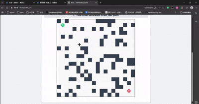

# 🎮 ROS 2 迷宫行者 (ROS 2 Pathfinding Game)

本项目已从最初的云端监控面板演变成一个全栈交互式的 **ROS 2 路径规划游戏**。它展示了如何结合 **ROS 2 Humble**、**Docker**、**WebSockets** 和 **HTML5 Canvas** 进行机器人全栈开发。

## 📺 演示 (Demo)




## ✨ 主要特性

### 🏆 挑战模式 (Challenge Mode) - 新增!
*   **随机关卡**: 每次点击都会生成带有随机障碍物的全新地图。
*   **交互式玩法**: 使用鼠标从 **绿色起点 (S)** 拖拽画线到 **红色终点 (G)**。
*   **胜利检测**: 系统会自动检测你是否成功抵达终点！
*   **AI 提示**: 卡住了？点击按钮让 ROS 2 后端使用 A* 算法为你解题。

### ✏️ 自定义模式 (Custom Mode) - 沙盒
*   **地图编辑器**: 设计你自己的迷宫。
*   **左键点击**: 设置 **起点 (Start)**。
*   **右键点击**: 设置 **终点 (Goal)**。
*   **Shift + 点击**: 添加或移除 **墙体 (Walls)**。
*   **AI 求解**: 实时验证你的迷宫是否有解。

## 🚀 快速开始 (Quick Start)

### 1. 🌐 在线体验 (Play Online)
无需安装任何环境，直接访问部署在腾讯云的在线演示地址：
👉 **[http://49.232.161.225/](http://49.232.161.225/)**

---

### 2. 🐳 Docker 部署 (推荐)
最简单、最稳定的本地运行方式，环境零污染。

**前置要求**:
*   已安装 Docker 和 Docker Compose。

**步骤**:
1.  **克隆仓库**:
    ```bash
    git clone https://github.com/ljk4/MyCloudRobot.git
    
    cd MyCloudRobot
    ```

2.  **一键启动**:
    ```bash
    docker compose up --build
    ```
    *(首次运行需要下载基础镜像，请耐心等待)*

3.  **访问游戏**:
    打开浏览器访问 `http://localhost` (或 `http://localhost:80`)。

---

### 3. 💻 本地源码部署 (Local Deployment)
适合 ROS 开发者进行调试或修改源码。

**前置要求**:
*   Ubuntu 22.04 LTS
*   ROS 2 Humble
*   Python 3.10+

**步骤**:

1.  **安装依赖**:
    ```bash
    sudo apt update
    sudo apt install -y ros-humble-rosbridge-suite nginx
    ```

2.  **编译工作空间**:
    ```bash
    cd ros_ws
    colcon build
    source install/setup.bash
    ```

3.  **启动后端**:
    ```bash
    # 启动路径规划节点和 rosbridge websocket
    ros2 launch cloud_monitor_pkg system.launch.py
    ```

4.  **启动前端** (新开一个终端):
    可以使用 Python 快速启动 HTTP 服务:
    ```bash
    cd web
    python3 -m http.server 8080
    ```

5.  **访问**:
    打开浏览器访问 `http://localhost:8080`。

---

### 4. ☁️ 部署到云服务器 (Deploy to Server)
以腾讯云/阿里云为例。

**步骤**:
1.  **购买服务器**: 推荐 Ubuntu 20.04/22.04 镜像。
2.  **配置安全组 (防火墙)**:
    *   开放 TCP 端口 **80** (Web访问)。
    *   开放 TCP 端口 **9090** (WebSocket通信)。
    *   *注：本项目容器内部使用 8080 端口，但已映射到服务器的 80 端口，因此无需在防火墙开放 8080。*
3.  **安装环境**:
    使用项目自带的脚本一键安装 Docker 和常用工具 (使用国内镜像源)：
    ```bash
    # 赋予执行权限
    chmod +x install-docker.sh
    # 运行安装脚本
    ./install-docker.sh
    ```
4.  **部署项目**:
    ```bash
    docker compose up -d
    ```
5.  **访问**: 打开浏览器访问 `http://<你的服务器公网IP>` (默认端口 80，无需输入)。

---

## 🎮 玩法说明

### 模式 1: 挑战模式 (Challenge)
1.  点击 **"🎲 New Random Level"** 生成新地图。
2.  **按住鼠标左键** 从 **S (起点)** 开始拖动，绘制你的绿色路径。
3.  避开黑色的障碍物！
4.  画线触碰到 **G (终点)** 即可获胜！ 🎉
5.  如果需要帮助，点击 **"🤖 AI Solve"** 查看参考路径（蓝线）。

### 模式 2: 自定义模式 (Custom)
1.  切换到 **"✏️ Custom Mode"**。
2.  **左键** 设置起点，**右键** 设置终点。
3.  按住 **Shift 键并点击** 生成墙体障碍。
4.  点击 **"🤖 AI Solve"** 查看 A* 算法计算的最短路径。

## 🛠️ 技术架构

*   **前端**: HTML5, JavaScript (Canvas API), `roslibjs`。
*   **后端**: Python ROS 2 节点 (`path_planner_node.py`)。
    *   订阅 `/game_request` (JSON数据: 地图, 起点, 终点)。
    *   发布 `/game_response` (JSON数据: 路径坐标)。
    *   算法: **A* (A-Star)** 路径搜索算法。
*   **通信**: 通过 `rosbridge_server` 实现 WebSocket 通信。
*   **部署**: Docker Compose 配合多阶段构建 (Multi-stage builds)。

## ⚙️ CI/CD 与构建优化

本项目采用 **双层镜像构建策略 (Two-Layer Build Strategy)** 以优化 CI/CD 流水线效率：

1.  **基础镜像 (Base Image)**:
    *   **内容**: 包含 Ubuntu 22.04, ROS 2 Humble 核心组件, Python 依赖 (NumPy, OpenCV 等) 及构建工具。
    *   **更新频率**: 低。仅在添加新的系统依赖时重新构建。
    *   **预构建**: 已推送到 Docker Hub (`ljk4/cloud-robot-viz-base:latest`)。

2.  **应用镜像 (App Image)**:
    *   **内容**: 仅包含本项目的业务源代码 (`ros_ws/src`) 和前端文件。
    *   **构建速度**: 极快 (< 10s)。利用 Docker 层缓存机制，开发时无需重复安装 ROS 依赖。

这种策略显著减少了 `docker-compose up --build` 的等待时间，并加速了云端部署流程。

### 🤖 GitHub Actions Workflow

本项目包含两套自动化的 CI/CD 流程：

1.  **CI - Build & Test (`ci-build-test.yml`)**:
    *   **触发条件**: 任意分支的 `push` 或 `pull_request`。
    *   **执行环境**: `ros:humble` (Docker 容器)。
    *   **任务**:
        *   安装依赖 (`rosdep`)。
        *   编译工作空间 (`colcon build`)。
        *   代码静态分析 (Lint) 与单元测试 (Unit Test)。

2.  **CD - Build & Deploy (`cd-deploy.yml`)**:
    *   **触发条件**: 代码推送到 `main` 分支。
    *   **任务**:
        *   构建多架构 Docker 镜像 (amd64, arm64)。
        *   推送镜像至 Docker Hub。
        *   **自动部署**: 通过 SSH 连接腾讯云服务器，拉取最新镜像并重启服务，实现**零停机更新**。

## 📂 项目结构

```
.
├── docker/                 # Docker 配置
│   ├── Dockerfile          # 多阶段 ROS 2 构建文件
│   └── entrypoint.sh       # 容器启动脚本
│   └── nginx.conf          # Nginx 配置文件
├── ros_ws/
│   └── src/
│       └── cloud_monitor_pkg/
│           ├── cloud_monitor_pkg/
│           │   └── path_planner_node.py  # 核心寻路逻辑 (A*)
│           └── launch/
│               └── system.launch.py      # ROS 2 启动文件
├── tests/                  # 测试代码
│   └── integration_test.py # 集成测试脚本
├── web/
│   └── index.html          # 游戏主界面 (HTML5 Canvas)
└── install-docker.sh       # 环境安装脚本
```
