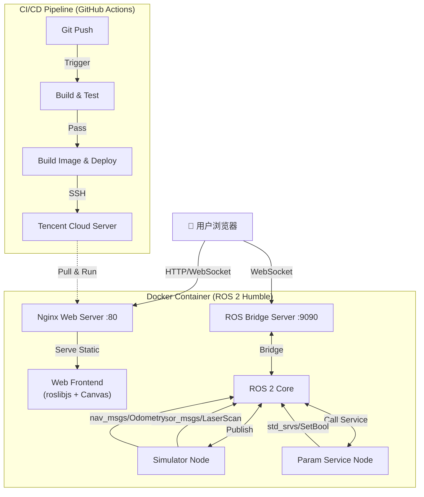

# ☁️ Cloud Robot Web Viz (基于 ROS 2 的云端机器人可视化与调参系统)

[](https://github.com/ljk4/MyCloudRobot/actions/workflows/ci-build-test.yml)
[](https://github.com/MyCloudRobot/actions/workflows/cd-deploy.yml)
[](https://hub.docker.com/r/ljk4/cloud-robot-viz)
[](LICENSE)

> **项目简介**：一个基于 **ROS 2 Humble**、**Docker** 和 **GitHub Actions** 的全栈机器人云端监控示例平台。该项目实现了通过浏览器即可实时可视化传感器数据（激光雷达/里程计）并动态调整机器人参数（数据非真实，仅作为示例）。

---

## 🌟 项目亮点

*   **🐳 容器化隔离架构**：在 Ubuntu 24.04 宿主机上，通过 Docker 运行 ROS 2 Humble (LTS) 环境。
*   **🌐 轻量级 Web 可视化**：采用 **WebSocket + Canvas** ，仅传输 JSON 数据。
*   **🔄 CI/CD 流水线**：集成 **GitHub Actions**，实现代码提交后的自动编译、**容器内集成测试**、多架构镜像构建及云服务器自动部署。
*   **🛡️ 安全实践**：实施 Non-root 用户运行、Docker Healthcheck 健康检查、多阶段构建优化镜像体积。
*   **🤖 全栈 ROS 2 开发**：涵盖节点开发 (`rclpy`)、通信机制 (Topic/Service)、Launch 文件编排、自定义消息处理。

---

## 🏗️ 系统架构



---

## 🛠️ 技术栈

| 领域 | 技术选型 |
| :--- | :--- |
| **机器人中间件** | ROS 2 Humble Hawksbill (Ubuntu 22.04 Base) |
| **开发语言** | Python 3.10 (`rclpy`), JavaScript (ES6+) |
| **容器化** | Docker (Multi-stage Build), Docker Compose |
| **CI/CD** | GitHub Actions (Buildx, Self-hosted Runner logic) |
| **Web 服务** | Nginx, rosbridge_server (WebSocket), roslibjs |
| **可视化** | HTML5 Canvas (自定义雷达绘制) |
| **云平台** | Tencent Cloud (Ubuntu 24.04), Docker Hub |

---

## 🚀 快速开始

### 前置要求
*   操作系统：Ubuntu 20.04/22.04/24.04 (推荐 Linux 环境)
*   **Docker Engine** (20.10+) 和 **Docker Compose** (v2.0+)
*   **Git** 版本控制工具
*   (可选) 本地已安装 ROS 2 Humble 用于原生开发

### 方法一：Docker Compose 一键启动 (推荐)

```bash
# 1. 克隆项目
git clone https://github.com/ljk4/MyCloudRobot.git
cd MyCloudRobot

# 2. 启动所有服务
docker compose up -d

# 3. 查看日志
docker compose logs -f

# 4. 访问可视化界面
# 打开浏览器访问：http://localhost

# 5. 停止并移除容器
docker compose down
```

### 方法二：直接运行 Docker 镜像

```bash
docker run -d -p 80:80 -p 9090:9090 --name cloud-robot-viz ljk4/cloud-robot-viz:latest
```

### 方法三：本地源码开发

```bash
# 1. 编译工作空间
cd ros_ws
source /opt/ros/humble/setup.bash
colcon build --symlink-install

# 2. 加载环境
source install/setup.bash

# 3. 运行节点
ros2 launch cloud_monitor_pkg system_launch.py

# 4. 单独启动 rosbridge (需另外开终端)
ros2 launch rosbridge_server rosbridge_websocket_launch.xml port:=9090

# 5. 启动 Web 服务 (需另外开终端)
cd web
python3 -m http.server 8000
# 访问 http://localhost:8000
```

> **注意**：如果遇到 `ros2 run` 找不到 executables 的问题，请检查 `setup.cfg` 是否正确配置安装路径至 `lib/cloud_monitor_pkg`。本项目的 `setup.py` 已包含修复配置。

---

## 🎮 功能演示

### 1. 实时雷达可视化
系统模拟了一个做圆周运动的机器人，并发布带有正弦波扰动的激光雷达数据。
*   **绿色线条**：实时扫描的障碍物轮廓。
*   **红色圆点**：机器人中心位置。
*   **动态效果**：障碍物随时间波动，模拟动态环境。

### 2. 动态参数调优
通过网页控制面板，可以实时修改机器人运行状态：
*   **🛡️ 安全模式**：点击后，后端节点接收 Service 请求，将最大速度限制为 `0.2 m/s`。
*   **🚀 正常模式**：恢复速度至 `0.8 m/s`。
*   **🔄 重置系统**：将所有参数恢复默认值。
*   **📝 实时日志**：网页底部实时显示后端操作反馈。

---

## 🔄 CI/CD 流水线详解

本项目配置了两条核心工作流，位于 `.github/workflows/`：

### 1. CI: 构建与测试 (`ci-build-test.yml`)
每次 Push 或 PR 触发：
1.  **环境准备**：拉取 `ros:humble` 容器，安装 `python3-pip` 和依赖。
2.  **代码编译**：执行 `colcon build`，确保 C++/Python 代码无语法错误。
3.  **单元测试**：运行 `colcon test` 进行静态检查和基础测试。
4.  **🧪 集成测试**：
    *   后台启动 `param_service` 节点。
    *   运行 `pytest` 脚本，**主动调用 ROS Service** (`/set_safety_mode`)。
    *   断言返回结果，验证 ROS 通信与业务逻辑正确性。

### 2. CD: 构建与部署 (`cd-deploy.yml`)
仅当推送到 `main` 分支时触发：
1.  **多架构构建**：使用 `docker buildx` 同时构建 `linux/amd64` (服务器) 和 `linux/arm64` (树莓派) 镜像。
2.  **缓存加速**：利用 Registry Cache 加速后续构建过程。
3.  **自动推送**：将镜像推送到 Docker Hub，标记为 `:latest` 和 `:<commit-hash>`。
4.  **🚀 自动部署**：
    *   通过 SSH 连接腾讯云服务器。
    *   拉取最新镜像。
    *   执行滚动更新 (`stop` -> `rm` -> `run`)，保证服务零停机升级。

---

## 📂 项目结构

```text
MyCloudRobot/
├── .github/workflows/       # CI/CD 配置文件
├── docker/                  # Docker 构建相关
│   ├── Dockerfile           # 多阶段构建脚本
│   ├── entrypoint.sh        # 容器入口脚本
│   └── nginx.conf           # Nginx 配置
├── ros_ws/src/              # ROS 2 工作空间
│   └── cloud_monitor_pkg/   # 核心功能包
│       ├── cloud_monitor_pkg/  # Python 模块
│       ├── resource/           # ROS 资源标记文件
│       ├── launch/             # 启动文件
│       ├── package.xml
│       └── setup.py
├── tests/                   # 全局集成测试
│   └── integration_test.py
├── web/                     # 前端源码
│   ├── index.html
│   └── static/style.css
├── docker-compose.yml
└── README.md
```

---

## 💻 核心代码解析

### 1. 动态调参服务 (`param_service_node.py`)
展示了 ROS 2 Service 的标准写法，如何处理请求并修改内部参数。

```python
def cb_safe(self, req, res):
    mode = req.data
    # 更新 ROS 参数服务器
    self.set_parameters([rclpy.parameter.Parameter('robot.safety_mode', value=mode)])
    speed = 0.2 if mode else 0.8
    self.set_parameters([rclpy.parameter.Parameter('robot.max_speed', value=speed)])
    res.success = True
    res.message = f"Switched to {'SAFE' if mode else 'NORMAL'}"
    return res
```

### 2. 前端交互 (`index.html`)
使用 `roslibjs` 连接 WebSocket，实现双向通信。

```javascript
// 连接 ROS Bridge
const ros = new ROSLIB.Ros({ url: 'ws://' + window.location.hostname + ':9090' });

// 调用服务
const client = new ROSLIB.Service({
    ros : ros,
    name : '/set_safety_mode',
    serviceType : 'std_srvs/SetBool'
});
client.callService(request, (result) => {
    console.log(result.message);
});
```

### 3. Dockerfile 多阶段构建
有效减小最终镜像体积，仅包含运行时必要文件。

```dockerfile
# Stage 1: 编译
FROM ros:humble AS builder
# ... 安装依赖并 colcon build ...

# Stage 2: 运行
FROM ros:humble
# 仅复制编译产物和运行时工具
COPY --from=builder /root/ws/install /root/ws/install
# ... 安装 nginx, rosbridge ...
```

---

## 🧪 测试与验证

### 本地运行集成测试
```bash
cd ros_ws
source /opt/ros/humble/setup.bash
colcon build
source install/setup.bash

# 启动被测节点
ros2 run cloud_monitor_pkg param_service &

# 运行 pytest
cd ..
python3 tests/integration_test.py
```

### 验证 Docker 健康检查
```bash
docker inspect --format='{{.State.Health.Status}}' cloud-robot-viz
# 输出应为: healthy
```

---

## 🔧 常见问题排查 (Troubleshooting)

如果在开发或部署过程中遇到问题，请首先查看详细的 [CI/CD 故障排查指南](CI_TROUBLESHOOTING.md)。

**常见问题速查：**
1.  **本地运行 `ros2 run` 报错 `No executable found`**：
    *   原因：Python 脚本未正确安装到 `lib/` 目录。
    *   解决：检查 `setup.cfg` 配置，确保 `script-dir=$base/lib/cloud_monitor_pkg`。
2.  **Docker 构建失败 (GPG error)**：
    *   原因：ROS 2 镜像源密钥过期或网络问题。
    *   解决：在 Dockerfile 中更新 GPG 密钥获取方式，或移除失效的镜像源配置。
3.  **集成测试文件找不到**：
    *   原因：文件名包含意外空格 (如 `' integration_test.py'`)。
    *   解决：重命名文件去除空格。

---

## 📝 常见问题 (FAQ)

**Q: 为什么选择 Web 可视化而不是 Rviz?**
A: 云服务器通常无显卡且带宽有限。Rviz 需要传输大量图像帧或通过 X11 转发，延迟高且卡顿。Web 方案仅传输结构化数据 (JSON)，由浏览器本地渲染，流畅度更高。

**Q: 如何在实车上部署？**
A: 只需将 Docker 镜像拉取到实车 (支持 ARM64)，修改 `simulator_node` 为真实的驱动节点 (如雷达驱动、里程计节点)，其余 Web 和 Bridge 层代码无需改动。

**Q: CI/CD 中的集成测试有什么意义？**
A: 它确保了不仅代码能编译，而且 ROS 节点间的通信逻辑 (Service 调用、参数设置) 是正确的。这能有效防止“编译成功但运行报错”的情况。

---

## 📄 许可证

本项目采用 Apache 2.0 许可证。见 [LICENSE](LICENSE) 文件。

---

## 👤 作者

*   **Developer**: [Your Name]
*   **Email**: your.email@example.com
*   **Blog/Portfolio**: [Your Website Link]

> 💡 **致谢**：感谢 OSRF 提供的 ROS 2 基础镜像，以及 Foxglove 团队在 Web 机器人工具链上的启发。

---

### 🎓 面试项目亮点建议

1.  **系统架构能力**：结合架构图解释 WebSocket 与 ROS 2 的数据交互流程。
2.  **工程化思维**：重点讲解 CI/CD 流程中的“集成测试”环节，展示对自动化测试与交付的理解。
3.  **容器化经验**：说明 Docker 多阶段构建对镜像体积的优化，以及 Non-root 用户运行的安全实践。
4.  **问题解决能力**：准备关于 ROS 2 节点通信、GPG 密钥处理或跨平台构建 (ARM64) 遇到的挑战与解决方案。